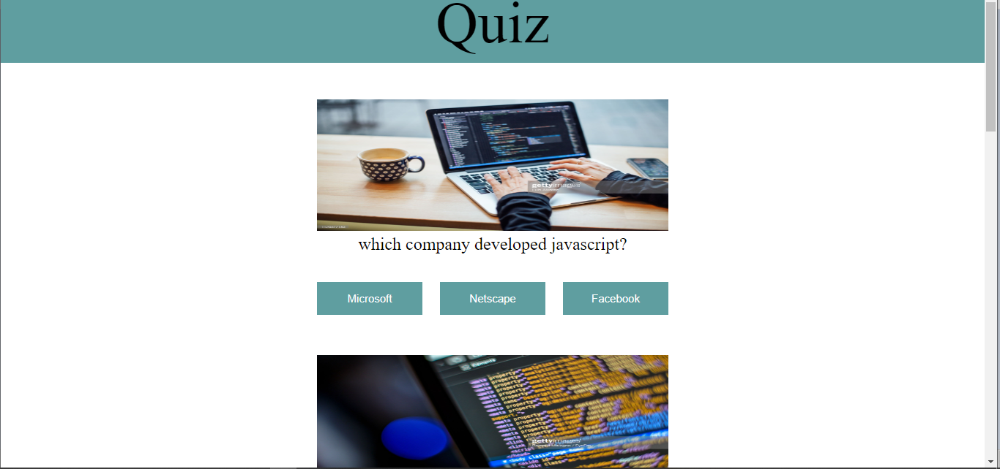

## Overview
just a webpage with buttons that turns green if you click on the right button with the answer to the question.
No backend .
Answers can be found  in the javaScript,so i guess its not a quiz.   
### The Goal
-- See hover and focus states for all buttons on the page
-- Change button background color of buttons if answer is right or wrong
### Screenshot

### Built with
- Semantic HTML5 markup
- CSS custom properties
- Flexbox
- Mobile-first workflow

### What I learned
--Learnt how to create html element dynamically.
 